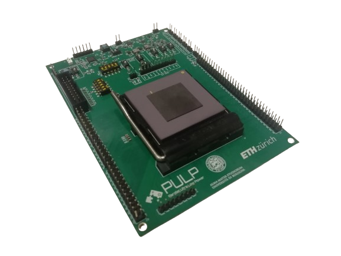

# Shaheen PCB Board
<div style="text-align: center;">
    
</div>

# Introduction

This repository houses Altium source files and PDF schematics for the Shaheen's PCB design.
The PCB designed for bringing up the Shaheen SoC serves as a versatile platform for initial chip testing and configuration. It provides flexible configuration options and extensive testability features, allowing for comprehensive evaluation and debugging of the Shaheen chip's functionality. This design facilitates the identification and resolution of potential issues, ensuring the chip performs as expected in various scenarios and applications.

This board has been utilized for the power and performance characterization of the Shaheen SoC.

We have designed this PCB to the best of our ability and it performed well for us. However we offer no warranty of any kind (see also LICENSE) and provide these as is, without any support.

# Structure of the repository

This repository contains the following folders:

- **`Schematic`**
    - It provides the schematic sheets of Shaheen
        - **`Schematic Sheets`**
            - Individual sheets representing different sections of the overall schematic design, such as power supply, signal routing, and peripheral connections.
        
        - **`Templates and Standards`**
            - Standardized templates and guidelines used to ensure consistency across the schematic documents.

- **`Lib`**
    - This folder contains the design library files

        - **`Component Libraries`**
            - Collections of all the components used in the Shaheen PCB design, each with detailed electrical symbols, parameters, and footprints.

        - **`Integrated Libraries`**
            - Combined libraries that integrate schematic symbols and corresponding PCB footprints for seamless design transfer.

- **`Documentation`**
    - The documentation folder includes PDFs of the schematics, the layout, and a 3D representation of the design.
    It also includes an introduction of the design including an high level block diagram representation and its configuration for bringing up Shaheen SoC.

# License

The Altium designer source files are released under Solderpad v0.51 (`SHL-0.51`) (see `LICENSE`)

# Publications

If you use these PCBs in your work, please cite us:

```
@ARTICLE{10423921,
  author={Valente, Luca and Nadalini, Alessandro and Veeran, Asif Hussain Chiralil and Sinigaglia, Mattia and Sá, Bruno and Wistoff, Nils and Tortorella, Yvan and Benatti, Simone and Psiakis, Rafail and Kulmala, Ari and Mohammad, Baker and Pinto, Sandro and Palossi, Daniele and Benini, Luca and Rossi, Davide},
  journal={IEEE Transactions on Circuits and Systems I: Regular Papers}, 
  title={A Heterogeneous RISC-V Based SoC for Secure Nano-UAV Navigation}, 
  year={2024},
  volume={},
  number={},
  pages={1-14},
  keywords={Standards;Energy efficiency;Drones;Virtual machine monitors;Silicon;Navigation;Internet of Things;Heterogeneous;Linux;low-power;autonomous nano-UAVs;RISC-V},
  doi={10.1109/TCSI.2024.3359044}}

@INPROCEEDINGS {10254698,
author = {L. Valente and A. Veeran and M. Sinigaglia and Y. Tortorella and A. Nadalini and N. Wistoff and B. Sa and A. Garofalo and R. Psiakis and M. Tolba and A. Kulmala and N. Limaye and O. Sinanoglu and S. Pinto and D. Palossi and L. Benini and B. Mohammad and D. Rossi},
booktitle = {2023 IEEE Hot Chips 35 Symposium (HCS)},
title = {Shaheen: An Open, Secure, and Scalable RV64 SoC for Autonomous Nano-UAVs},
year = {2023},
volume = {},
issn = {},
pages = {1-12},
abstract = {Open Source Hardware, the way it should be!},
keywords = {},
doi = {10.1109/HCS59251.2023.10254698},
url = {https://doi.ieeecomputersociety.org/10.1109/HCS59251.2023.10254698},
publisher = {IEEE Computer Society},
address = {Los Alamitos, CA, USA},
month = {aug}
}
```
